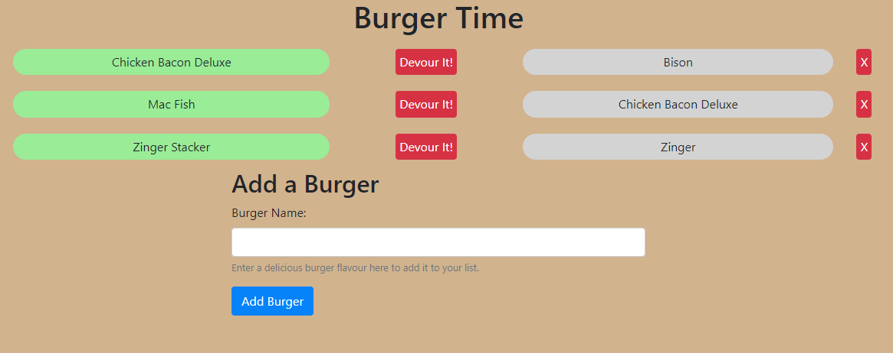
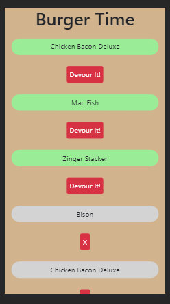

# Burger Time
### By trojanface

## Description
A web app that demonstrates capabilities of sequelize, node.js, mysql and handlebars in a MVC file structure. Enter your favourite burger flavours to add them to the database and then perform actions upon them such as devouring them and deleting them.

## Table of Contents

1. Description
2. Contents
3. Screenshot
4. Deployed
5. Installation
6. Usage
7. License
8. Contributors
9. Profile

## Link to Deployed App
https://not yet deployed

## Installation
1. run npm install

## Usage
1. Run node server.js
2. Open localhost
3. Use app

## License
Public Domain

## Contributors
trojanface

